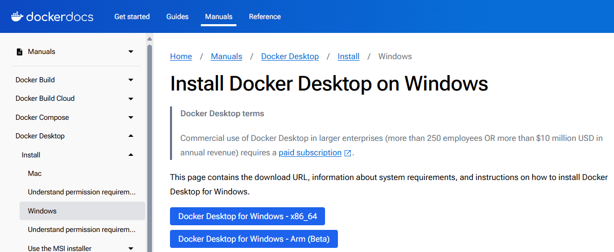
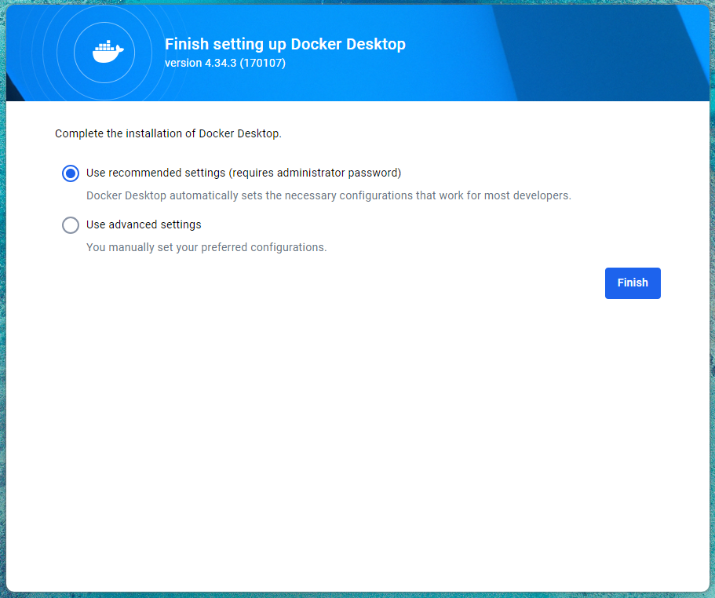
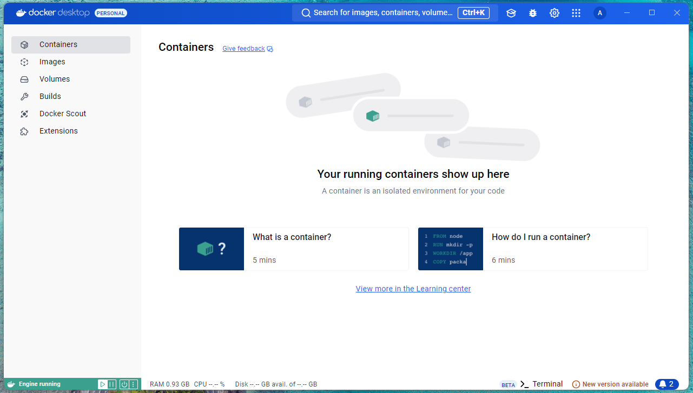
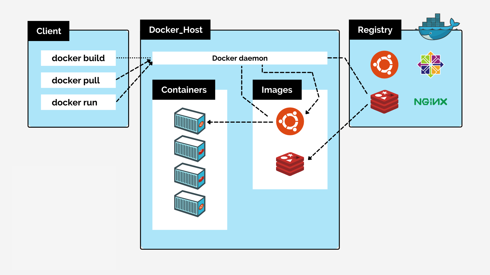
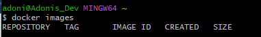
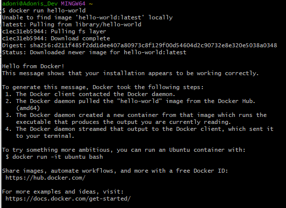
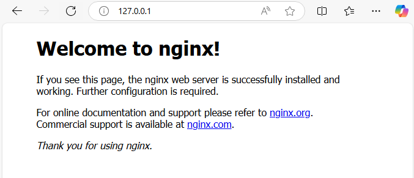

# Learning Docker

- [Learning Docker](#learning-docker)
  - [Installing Desktop Docker](#installing-desktop-docker)
  - [Differences between virtualisation and containerisation](#differences-between-virtualisation-and-containerisation)
    - [What is usually included in a Virtualization vs. Containerization](#what-is-usually-included-in-a-virtualization-vs-containerization)
    - [Contents of a Container vs. Virtual Machine](#contents-of-a-container-vs-virtual-machine)
  - [Benefits of Virtualization:](#benefits-of-virtualization)
  - [Benefits of Containerization:](#benefits-of-containerization)
  - [Benefits of Virtual Machines over Traditional Architecture:](#benefits-of-virtual-machines-over-traditional-architecture)
  - [Microservices](#microservices)
    - [What are they?](#what-are-they)
    - [How are they made possible?](#how-are-they-made-possible)
    - [Benefits:](#benefits)
  - [Docker](#docker)
    - [What is Docker?](#what-is-docker)
    - [Alternatives to Docker:](#alternatives-to-docker)
    - [How Docker Works (Architecture)](#how-docker-works-architecture)
    - [Success Story Using Docker](#success-story-using-docker)
  - [Docker Commands](#docker-commands)
  - [Task: Push host-custom-static-webpage container image to Docker Hub](#task-push-host-custom-static-webpage-container-image-to-docker-hub)
  - [Task: Automate docker image creation using a Dockerfile](#task-automate-docker-image-creation-using-a-dockerfile)

## Installing Desktop Docker

1. Navigate to https://docs.docker.com/desktop/install/windows-install/

2. Click Docker Desktop for **Windows - x86_64**
3. Follow the installation window.
4. Agree to the Docker service agreenment

1. Use the recomended settings

1. Confirm and sign in (Create an account if you dont have one)
2. Confirm Docker version by adding the following to a bash shell:

```bash
docker --version
```
8. On Docker Desktop the status should be green and the newer versions also state "Engine running".

*Note: If the status is not green, you will likely need to choose to "Run as Administrator". If you don't, you will get an error.*

## Differences between virtualisation and containerisation

* Virtualization creates multiple virtual machines (VMs) on a host system, each with its own guest operating system—including kernel and user space—running on virtualized hardware.
* Containerization isolates applications within containers that share the host system's operating system kernel. Containers package the application code along with its dependencies but do not include a separate OS kernel.

### What is usually included in a Virtualization vs. Containerization
* **Virtualization**: Uses hypervisors to run full OS instances on top of a host OS, each with its own guest OS, consuming more resources.
* **Containerization**: Runs applications in isolated environments using shared OS kernel, leading to smaller, faster, and more efficient resource usage.

### Contents of a Container vs. Virtual Machine
* **Container**: Includes application code, libraries, and dependencies, sharing the host OS kernel.
* **Virtual Machine (VM)**: Includes entire OS, application, libraries, and dependencies, isolated via a hypervisor.

## Benefits of Virtualization:

* Improved Resource Utilization: Virtual machines (VMs) enable multiple operating systems and applications to run on a single physical server, maximizing hardware usage and reducing costs.
* Isolation and Security: Each VM operates in a sandboxed environment, enhancing security by isolating applications from one another.
* Flexibility and Scalability: VMs can be easily created, cloned, or migrated, allowing for rapid scaling and efficient resource management.
* Simplified Management: Virtualization simplifies backup, recovery, and deployment processes since VMs are encapsulated files that can be managed centrally.
* Testing and Development: Provides safe environments for testing new software or updates without impacting production systems.

## Benefits of Containerization:

* Lightweight and Efficient: Containers share the host OS kernel, making them more lightweight and faster to start than VMs.
* Portability: Containers package applications with their dependencies, ensuring consistent behavior across different environments.
* Rapid Deployment: Streamlines the deployment process, enabling continuous integration and delivery pipelines.
* Scalability: Allows for quick scaling of applications to meet demand by spinning up additional container instances.
* Resource Efficiency: Consumes fewer system resources compared to VMs, leading to cost savings.

## Benefits of Virtual Machines over Traditional Architecture:

* Enhanced Resource Optimization: Traditional architectures often underutilize hardware, dedicating entire servers to single tasks. VMs consolidate workloads, maximizing hardware utilization.
* Cost Reduction: Fewer physical servers mean lower hardware, energy, and maintenance costs.
* Improved Disaster Recovery: VMs can be easily backed up, replicated, and restored, enhancing business continuity strategies.
* Hardware Independence: Virtualization abstracts the hardware layer, allowing VMs to run on any physical machine, reducing compatibility issues.
* Faster Provisioning and Deployment: Setting up a new VM is quicker than procuring and configuring a new physical server, accelerating project timelines.

## Microservices

### What are they?

**Microservices** are an architectural approach to software development where an application is structured as a collection of small, independent services. Each service focuses on a specific business capability, runs in its own process, and communicates with other services through lightweight protocols, often HTTP/REST or messaging queues.

### How are they made possible?

* **Container**

* Advancements in Containerization: Tools like Docker enable packaging services with their dependencies, ensuring consistency across environments.
* Orchestration Platforms: Technologies like Kubernetes manage, scale, and orchestrate containers, making it easier to deploy microservices at scale.
* DevOps and CI/CD Pipelines: Automated testing and deployment processes allow for rapid and reliable delivery of microservices.
* APIs and Messaging Systems: Robust communication mechanisms facilitate interaction between services.
* Cloud Computing: Elastic infrastructure provided by cloud platforms supports the dynamic scaling needs of microservices.

### Benefits:

* Scalability: Services can be scaled independently based on demand, optimizing resource usage.
* Flexibility in Technology Stack: Teams can choose the most suitable technology for each service without affecting the entire application.
* Independent Deployment: Services can be updated or deployed without downtime for the whole system.
* Fault Isolation: Issues in one service are less likely to impact others, enhancing system resilience.
* Improved Development Velocity: Smaller, focused teams can work concurrently on different services, accelerating development.
* Easier Maintenance: Simplified codebases for each service make understanding and modifying code more manageable.
* Organizational Alignment: Mirrors modern agile and DevOps practices, promoting collaboration and ownership within teams.

## Docker

### What is Docker?

Docker is an open-source platform that automates the deployment, scaling, and management of applications using containerization. It allows developers to package applications and their dependencies into standardized units called containers, ensuring consistency across different environments.

### Alternatives to Docker:

* Podman: A daemonless container engine for developing, managing, and running containers on Linux systems.
* Containerd: An industry-standard container runtime that manages the complete container lifecycle.
* CRI-O: A lightweight container runtime designed for Kubernetes.
* LXC/LXD: Linux Containers that offer system-level virtualization for running multiple isolated Linux systems.
* rkt (Rocket): A security-focused container engine by CoreOS (note: development has been discontinued).

How Docker Works (Docker Architecture/API):

Docker Architecture:

* Docker Client: The command-line interface or GUI through which users interact with Docker.
* Docker Daemon (dockerd): A background service that handles building, running, and distributing containers.
* Docker Registries: Repositories like Docker Hub where Docker images are stored and shared.

Docker Objects:

* Images: Read-only templates used to create containers.
* Containers: Runnable instances of images that include the application and its environment.
* Networks and Volumes: Facilitate communication between containers and manage persistent data storage.

### How Docker Works (Architecture)

* **Docker Client**: Users interact with Docker through the Client, which sends commands to the Docker Daemon over a REST API to manage containers and images locally or remotely.

* **Docker Daemon**: Running on the host machine, the Daemon (dockerd) performs tasks like building images, running containers, and managing storage and networks, handling all container lifecycle requests from the Client.

* **Docker Registry**: Docker Registries store and distribute images, with Docker Hub as the default public registry. The Daemon pulls images from a registry if they’re not available locally, ensuring containers have the necessary files.

* **Images and Layered Filesystem**: Docker images use a layered filesystem that builds upon base images with modifications, optimizing storage by reusing layers. Union mounts combine these layers into a single view, enabling efficient storage and distribution.



### Success Story Using Docker

**Spotify**:

* Spotify adopted Docker to enhance its development and deployment processes.
* By containerizing services, they achieved consistent environments from development to production.
* Docker enabled rapid scaling of microservices, improved resource utilization, and faster deployment times.
* The transition to Docker contributed to increased developer productivity and operational efficiency.

## Docker Commands

Display images (Size, created date, name tag, etc.)

```bash
docker images
```



Runs the hello-world container. The first time this is run if the container isn't stored locally it will fetch it from Docker-HUB (Registry):

```bash
docker run hello-world
```



Shows all running containers

```bash
docker ps
```

Downlaoding the latest version of nginx and will run it on port 80 in your localhost

```bash
docker run -d -p 80:80 nginx
```



Stops a running process by specifying the docker proccess ID or name.

```bash
docker stop <container_name_or_id>
```

Shows all containers whether running or stopped.

```bash
docker ps -a
```

Starts a container.

```bash
docker start <container name>
```

Use `docker exec` with `-it` to start an interactive shell:

```bash
docker exec -it <container_id> sh
```

If you get an *Error response from daemon: No such container: <container_id> try (Windows-Specific: Use winpty) using Git Bash on Windows, winpty may be needed for interactive commands. Set an alias to simplify:

```bash
alias docker="winpty docker"
```

Then try again:

```bash
docker exec -it <container_id> sh
```

## Task: Push host-custom-static-webpage container image to Docker Hub

Create an image from your running container which is running nginx with the index.html file we already modified in our code-along

1. Commit this container to create an image.

```bash
docker commit kind_yonath adonisdev/nginx-264
```

2. Verify the Image. List your images to ensure the new image was created:

```bash
docker images
```

3. Login to your docker account by running the below command and following the shell instructions.

```bash
docker login
```

4. Push the newly created image to your Docker Hub repository.

```bash
docker push adonisdev/nginx-264
```

1. Run the Image from Docker Hub: Use docker to pull and run the image from Docker

```bash
docker run -d -p 81:80 adonisdev/nginx-264
```

## Task: Automate docker image creation using a Dockerfile


1. Create a New Folder for Your Project

This folder will serve as the working directory for our project. Creating a dedicated folder helps keep all related files organized, making it easier to manage and share:

```bash
mkdir tech264-mod-nginx-dockerfile
cd tech264-mod-nginx-dockerfile
```

2. Create a index.html File

Create an index.html file within this folder that will replace Nginx's default page.

```bash
nano index.html
```

Type the below html code:

```html
<!DOCTYPE html>
<html>
<head>
<title>Welcome to nginx!</title>
<style>
html { color-scheme: light dark; }
body { width: 35em; margin: 0 auto; background-color: blue; color: white; font-family: Tahoma, Verdana, Arial, sans-serif; }
</style>
</head>
<body>
<h1>Welcome to tech264!</h1>
<p>If you see this page, the nginx web server is successfully installed and
working. Further configuration is required.</p>

<p>For online documentation and support please refer to
<a href="http://nginx.org/">nginx.org</a>.<br/>
Commercial support is available at
<a href="http://nginx.com/">nginx.com</a>.</p>

<p><em>Thank you for using nginx.</em></p>
</body>
</html>
```

3. Create a Dockerfile

The Dockerfile is the set of instructions that Docker uses to build your image. It specifies what base image to use, what files to add or replace, and any configuration for the environment.

Inside your project folder, create a file named Dockerfile

```bash
nano Dockerfile
```

Add the following contents:

```dockerfile
# Step 1: Use the official Nginx base image
FROM nginx:latest

# Step 2: Copy our custom index.html to replace the default Nginx page
COPY index.html /usr/share/nginx/html/index.html

# Step 3: Expose port 80 so the container can serve HTTP traffic
EXPOSE 80
```

4. Build the Image

Now that we have a Dockerfile and a custom index.html, it’s time to build our Docker image.

In the terminal, run the following command in your project directory:

```bash
docker build -t adonisdevtech264-nginx-auto:v1 .
```

5. Run the Container

Once the image is built, we’ll run it to make sure it works as expected.

Use the following command to start a new container using our custom image:

```bash
docker run -d -p 80:80 tech264-nginx-auto:v1
```

6. Once we confirm that the image works, we’ll push the Image to Docker Hub so it can be easily shared and accessed.

*Log in to Docker Hub (if not already logged in): `docker login`*

Upload the image to your Docker Hub account with the following command:

```bash
docker push adonisdev/tech264-nginx-auto:v1
```

7. Share the Docker Run Command Link

After confirming that the image is on Docker Hub, you can share this command with others to run your custom image

```bash
docker run -d -p 80:80 adonisdev/tech264-nginx-auto:v1
```
