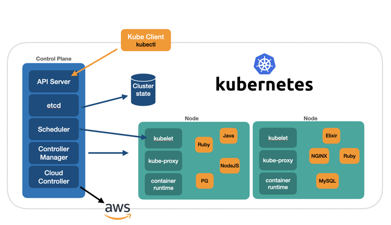
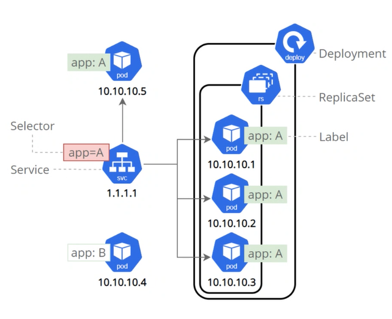

# Learning Kubernetes

## Kubernetes Reasearch

### Why is Kubernetes Needed?

Kubernetes is needed to manage containerized applications in a clustered environment. It automates the deployment, scaling, and operation of application containers across clusters of hosts. This orchestration simplifies the complexities of managing microservices and distributed systems, ensuring applications run reliably and efficiently.

### Benefits of Kubernetes

* **Rollback Changes**
* **Load-Balancing**
* **Open-Source**
* **Self-Healing**
* **Scalability**: Automatically scales applications up or down based on demand.
* **High Availability**: Provides self-healing mechanisms like auto-restarting, rescheduling, and replicating containers.
* **Portability**: Works across various environments—from on-premises to public clouds—ensuring consistent operations.
* **Resource Optimization**: Efficiently utilizes infrastructure resources by managing container placement and resource allocation.
* **Extensibility**: Offers a modular architecture with a rich ecosystem of plugins and integrations.

### Success Stories

* **Spotify**: Adopted Kubernetes to manage its microservices architecture, improving deployment speed and resource utilization.
* **The New York Times**: Migrated to Kubernetes to streamline their content delivery, resulting in faster deployment times and improved scalability.
* **CERN**: Uses Kubernetes to handle vast amounts of data processing for particle physics research, enhancing computational efficiency.
* **Airbnb**: Implemented Kubernetes to better manage scaling demands, leading to more efficient infrastructure management.

### Kubernetes Architecture

Kubernetes architecture is based on a master-worker model designed for orchestrating containerized applications across clusters of hosts. Here’s a concise breakdown:

* **Control Plane (Master Node)**: The control plane is responsible for managing the entire Kubernetes cluster, making scheduling decisions, and orchestrating workloads. It includes:

  * API Server: The main entry point to the Kubernetes cluster, handling all REST requests and exposing the Kubernetes API.
  * etcd: A key-value store that stores all cluster data, including configuration and state information.
  * Controller Manager: Monitors the cluster state and makes adjustments (e.g., scaling and replica management) to meet the desired state.
  * Scheduler: Assigns newly created pods to nodes based on resource availability, constraints, and policies.

* Worker Nodes: These nodes run the applications in pods and report to the control plane. Each worker node includes:

  * Kubelet: The main agent on each worker node that receives instructions from the API server and manages pod lifecycle.
  * Kube-proxy: Manages network rules on each node to enable communication within and outside the cluster.
  * Container Runtime: The software (e.g., Docker, containerd) responsible for running containers.
  
* Pods: The smallest deployable units in Kubernetes, representing a single instance of a running process. Pods can contain one or more tightly coupled containers.



*Note: If you would like to run a small Kubernetes service for testing you can run Minicube*

### What is a Cluster?

* Made up of at least 1 **Master Node** and 1 **Worker Node**.

A cluster in Kubernetes is a group of machines (nodes) that work together to run and manage containerized applications. It includes a control plane for orchestration and worker nodes for running workloads.

### Master vs. Worker Nodes

* **Master Nodes (works on the Control Plane)**: Manage the cluster, making scheduling and orchestration decisions, and maintain the desired state. They host components like the API server, controller manager, scheduler, and etcd.

* **Worker Nodes (work on the Data Plane)**: Run application workloads in containers within pods, managed by the control plane. Each worker has components like the kubelet, kube-proxy, and container runtime.

### Pros and Cons of Using Managed Service vs. Launching Your Own

* **Managed Service (e.g., GKE, EKS, AKS)**
  * **Pros**: Reduces operational overhead, automated updates and scaling, easy integrations, and high availability by default.
    * **Especially with Azure (AKS)**: Only charged for the Worker Nodes

  * **Cons**: Higher costs, limited control over infrastructure, and potential vendor lock-in.

* **Launching Your Own (Self-managed)**

*Recomended to have a minimum of 3 Master Nodes - Redundancy*

  * **Pros**: Full control over configuration, infrastructure choice, and customization; potentially lower costs at scale.
  * **Cons**: Requires significant operational knowledge, higher maintenance, and manual scaling and updates.

### Control Plane vs. Data Plane
* Control Plane: Manages the Kubernetes cluster, making decisions about scheduling, scaling, and maintaining the desired state.
* Data Plane: Executes the workloads (pods) on worker nodes, handling the actual application and network traffic.

### Kubernetes Objects
Kubernetes objects are persistent entities in the Kubernetes system that represent the desired state of resources and workloads in the cluster. Common ones include:

* **Pods**: The smallest deployable unit, representing mainly one (can more containers).
  * Pods have their own IP Adresses.
  * Pods are ephemeral as they are designed to be temporary.
* **Deployments**: Manages the deployment and scaling of pods, ensuring the desired number of replicas.
* **ReplicaSets**: Maintains a specified number of identical pod replicas for availability and resilience.
* **Services**: Exposes a set of pods as a network service, allowing external or internal access.
  * Handles/Worries the IP addresses to allow communication between pods.
* **ConfigMaps and Secrets**: Store configuration data and sensitive information, respectively, to be used by pods.
  * Secrets encrypt keys in base64 which easily decrypted.
* **Volume**: Important to store and persist data accross pods.
* **Namespace**: Logical way to group resources for an application.



### What Does it Mean a Pod is "Ephemeral"?
A pod is ephemeral because it is designed to be temporary and can be terminated, rescheduled, or replaced by Kubernetes at any time. Pods are not persistent and may be recreated on other nodes, leading to potential loss of state.

### How to Mitigate Security Concerns with Containers
* **Use Maintained Images**: Base images regularly updated by trusted sources reduce vulnerabilities.
* **Implement Image Scanning**: Use tools to scan images for vulnerabilities before deployment.
* **Limit Container Privileges (No-root privileges)**: Run containers with the least privileges necessary.
* **Use Network Policies**: Restrict pod-to-pod communication to only what’s required.
* **Regularly Update Dependencies**: Keep containers and dependencies updated.
* **Enable Runtime Security**: Use monitoring tools to detect unusual container behavior (logging).

### Maintained Images

**What Are They**: Pre-built container images managed and updated by trusted organizations or maintainers (e.g., official Docker or vendor-provided images).

**Pros**:
* Regular updates and security patches.
* Pre-configured with best practices.
* Reduced maintenance burden.
* Upto date documentation.

**Cons**:
* Limited customization and control.
* May include unnecessary components, increasing size.
* Dependency on maintainer updates and patch timing.

## Using Kubernetes

### Kubernetes Setup

1. Navigate to Docker Desktop
2. Navigate and select **Settings** > **Kubernetes** > **Enable Kubernetes** > **Apply & Install**

Check if Kubernetes is running `kubectl get all`

### Kubernetes Commands

`kubectl get deploy`: Return deployements

`kubectl get all`: Returns all runing kubernetes processes

`kubectl get pods` Return all pods

`kubectl get replicasets`: Return all replica Sets

``

### Creating Objects: Deployments

1. Create a new file for the deployment

```bash
nano nginx-deployment.yml
```

Add the following yml code

```yml
---
apiVersion: apps/v1 # specify api to use for deployement
kind: Deployment # Kind of service/object to create
metadata:
  name: nginx-deployment # name the deployement
spec:
  selector:
    matchLabels:
      app: nginx # Look for this label/tag to match k8 service

  # Create a PeplicaSet with instances/pods
  replicas: 5
  template:
    metadata:
      labels:
        app: nginx
    spec:
      containers:
      - name: nginx
        image: adonisdev/nginx-264
        ports: 
        - containerPort: 80
```

3. Check if the deployment object was created:

```bash
kubectl get deploy
```

### Creating Objects: Service

1. Creating a service to expose our pods to the outside world

*Node port service uses ports in this range 30000-32768*

2. Creating new file for the service

```bash
nano nginx-service.yml
```

Add the following yml code

```yml
---
apiVersion: v1
kind: Service
metadata:
  name: nginx-svc
  namespace: default
spec:
  ports:
  - nodePort: 30001
    port: 80
    targetPort: 80
  selector:
    app: nginx # Label to match service to deployment
  type: NodePort
```

3. Check if the service object was created:

```bash
kubectl get services
```

## Task: K8s deployment of NodeJS Sparta test app

.png)

### Creating the application

#### Step 1: Create the deployement

1. Create a project folder to deploy the kubernetes cluster

```bash
mkdir local-sparta-app-deploy
cd local-sparta-app-deploy
```

2. Create a file to provision the deployement

```bash
nano sparta-app-deploy.yml
```

Add the following contents:

```yml
---
apiVersion: apps/v1 # specify api to use for deployement
kind: Deployment # Kind of service/object to create
metadata:
  name: sparta-app-deployment # name the deployement
spec:
  selector:
    matchLabels:
      app: sparta-app # Look for this label/tag to match k8 service

  # Create a PeplicaSet with instances/pods
  replicas: 3
  template:
    metadata:
      labels:
        app: sparta-app
    spec:
      containers:
      - name: sparta-app
        image: adonisdev/tech264-prov-sparta-app-auto:v1
        ports: 
        - containerPort: 3000
        env:
          - name: DB_HOST
            value: "mongodb://mongodb-svc:27017/posts"
```

3. Run the script to create the deployement

```bash
kubectl create -f sparta-app-deploy.yml
```

#### Step 2: Create the Service

1. Create a project folder to provision the service for the kubernetes cluster

```bash
mkdir local-sparta-app-service
cd local-sparta-app-service
```

2. Create a file to provision the service

```bash
nano sparta-app-service.yml
```

Add the following contents:

```yml
---
apiVersion: v1
kind: Service
metadata:
  name: sparta-app-svc
  namespace: default
spec:
  ports:
  - nodePort: 30001
    port: 80
    targetPort: 3000
  selector:
    app: sparta-app # Label to match service to deployment
  type: NodePort
```

3. Run the script to create the service

```bash
kubectl create -f sparta-app-service.yml
```

### Creating the database

#### Step 1: Create the deployement

1. Create a project folder to deploy the kubernetes cluster

```bash
mkdir local-mongodb-deploy
cd local-mongodb-deploy
```

2. Create a file to provision the deployement

```bash
nano mongodb-deploy.yml
```

Add the following contents:

```yml
apiVersion: apps/v1 # specify api to use for deployement
kind: Deployment # Kind of service/object to create
metadata:
  name: mongodb-deployment # name the deployement
spec:
  selector:
    matchLabels:
      app: mongodb # Look for this label/tag to match k8 service

  # Create a PeplicaSet with instances/pods
  replicas: 1
  template:
    metadata:
      labels:
        app: mongodb
    spec:
      containers:
      - name: mongodb
        image: mongo:7.0.6
        ports:
        - containerPort: 27017
```

3. Run the script to create the deployement

```bash
kubectl create -f mongo-deploy.yml
```

#### Step 2: Create the Service

1. Create a project folder to provision the service for the kubernetes cluster

```bash
mkdir local-mongodb-service
cd local-mongodb-service
```

2. Create a file to provision the service

```bash
nano mongodb-service.yml
```

Add the following contents:

```yml
---
apiVersion: v1
kind: Service
metadata:
  name: mongodb-svc
  namespace: default
spec:
  ports:
  - nodePort: 30002
    port: 27017
    targetPort: 27017
  selector:
    app: mongodb # Label to match service to deployment
  type: NodePort
```

3. Run the script to create the service

```bash
kubectl create -f mongodb-service.yml
```